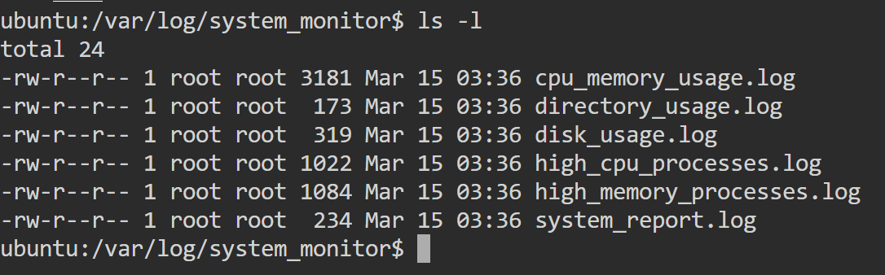
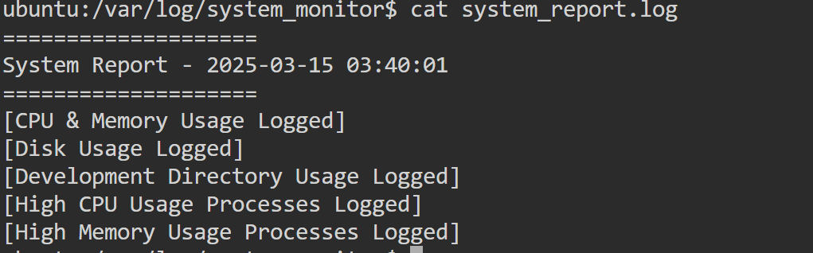
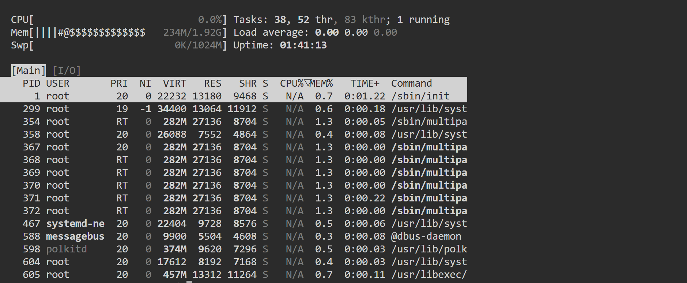
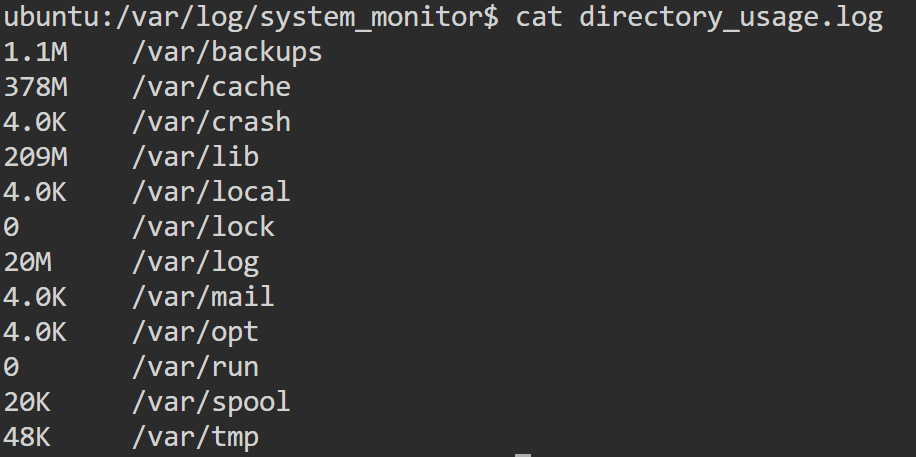
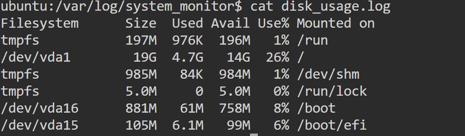
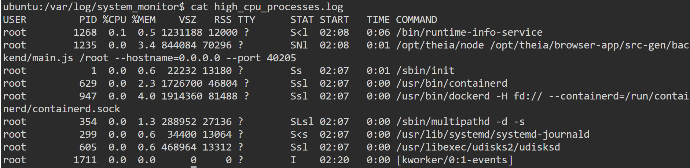
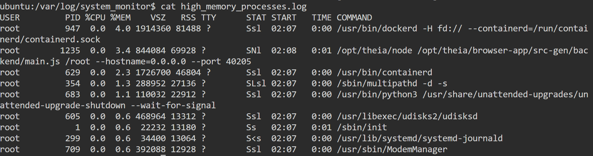
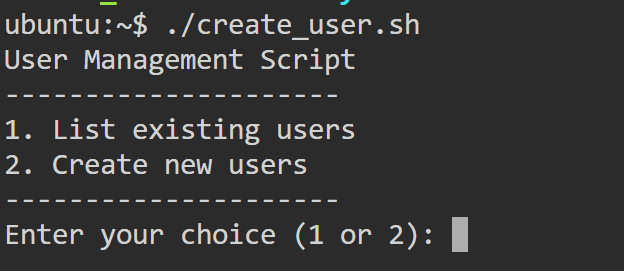
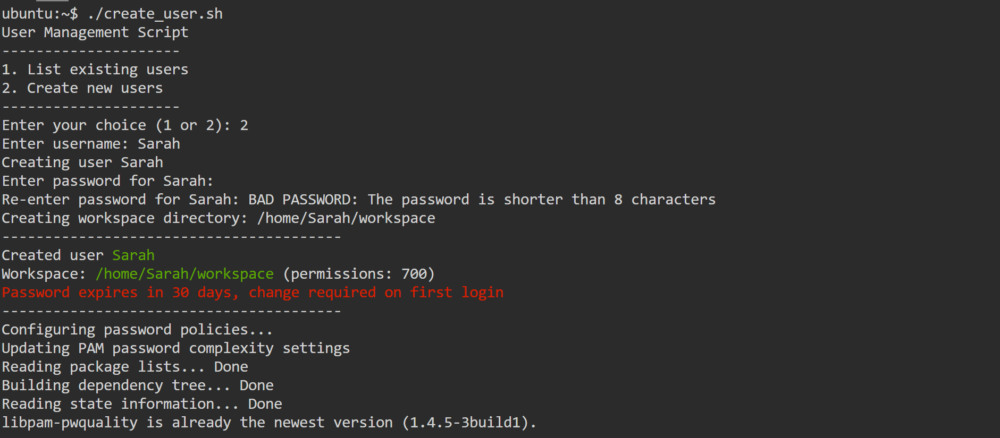
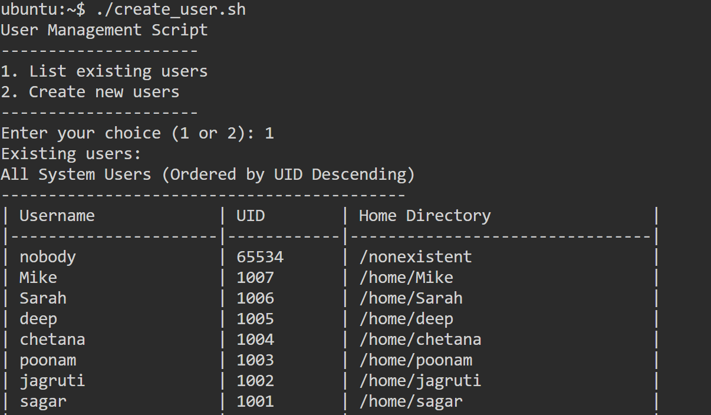

#### 📊 Task 1: System Monitoring Script

##### 📝 Overview
This Bash script monitors system resources such as CPU, memory, disk usage, and running processes. It logs information in a designated directory and sets up a cron job to run the script automatically.

##### ✨ Features
- 📁 Creates a log directory (`/var/log/system_monitor`) for storing logs
- 🔍 Checks if required utilities (`nmon`, `htop`, `df`, `du`, `ps`) are installed and installs missing ones
- 📈 Monitors CPU and memory usage using `htop` and `nmon`
- 💾 Logs disk usage details
- ⚠️ Captures high CPU and memory-consuming processes
- ⏱️ Configures a cron job to run the script periodically

#### 🔄 Script Breakdown

##### 1️⃣ Variable Initialization 📌
```bash
LOG_DIR="/var/log/system_monitor"
SYSTEM_REPORT_LOG=$LOG_DIR/system_report.log
HIGH_CPU_PROCESSES_LOG=$LOG_DIR/high_cpu_processes.log
HIGH_MEMORY_PROCESSES_LOG=$LOG_DIR/high_memory_processes.log
DISK_USAGE_LOG=$LOG_DIR/disk_usage.log
CPU_MEMORY_USAGE_LOG=$LOG_DIR/cpu_memory_usage.log
DIRECTORY_USAGE_LOG=$LOG_DIR/directory_usage.log
TIMESTAMP=$(date "+%Y-%m-%d %H:%M:%S")
SCRIPT_PATH="/root/system_monitor.sh"
```
- 📋 Defines the log directory and file paths for various logs
- 🕒 `TIMESTAMP` captures the current date and time for logging
- 📂 `SCRIPT_PATH` specifies the location of this script (used later for cron)

##### 2️⃣ Root Privilege Check 🔐
```bash
if [[ ${UID} -ne 0 ]]; then
    echo "Please run with sudo or as root"
    exit 1
fi
```
- 👮 Ensures the script is run as root (UID 0). If not, it exits with an error message

##### 3️⃣ Log Directory Management 📂
```bash
if [ ! -d "$LOG_DIR" ]; then
    mkdir -p $LOG_DIR || {
        echo "Error: Cannot create $LOG_DIR" >&2; exit 1;
    }
    chmod 750 $LOG_DIR
fi

if [ ! -w "$LOG_DIR" ]; then
    echo "Error: No write permission for $LOG_DIR. Adjust permissions or run with sudo." >&2
    exit 1
fi
```
- 🔍 Checks if the log directory exists; if not, creates it with `mkdir -p`
- 🔒 Verifies root privileges before creating the directory
- 🛡️ Sets permissions to `750` (read/write/execute for owner and group)
- ✅ Ensures the directory is writable; otherwise, exits with an error

##### 4️⃣ Dependency Check and Installation 🔧
```bash
for package in nmon htop; do
    if ! command -v "$package" &>/dev/null; then
        echo "$package is not installed. Attempting to install..."
        sudo apt-get update && sudo apt-get install -y "$package" || {
            echo "Error: Failed to install $package" >&2
            exit 1
        }
    fi
done
```
- 🔍 Ensures `nmon` and `htop` are installed for monitoring purposes
- 📦 Checks if each tool is installed; if not, installs it using `apt-get`

##### 5️⃣ Core Utility Verification ⚙️
```bash
for tool in df du ps; do
    if ! command -v "$tool" >/dev/null 2>&1; then
        echo "Error: Core utility $tool not found" >&2
        exit 1
    fi
done
```
- 🧰 Checks for the presence of `df`, `du`, and `ps` commands

##### 6️⃣ System Report Initialization 📝
```bash
{
    echo "===================="
    echo "System Report - $TIMESTAMP"
    echo "===================="
} > $SYSTEM_REPORT_LOG
```
- 📄 Creates/overwrites the `system_report.log` file with a header and timestamp

##### 7️⃣ CPU and Memory Usage Monitoring 💻
```bash
TERM=xterm htop -C -d 10 -n 1 > $CPU_MEMORY_USAGE_LOG
nmon -f -s 10 -c 6 -m $LOG_DIR &
echo "[CPU & Memory Usage Logged]" >> $SYSTEM_REPORT_LOG
```
- 📊 Runs `htop` non-interactively to log CPU/memory usage once (`-n 1`) with a 10-second delay (`-d 10`)
- 📈 Runs `nmon` in the background to capture 6 snapshots every 10 seconds, saving output to the log directory
- ✅ Appends a confirmation message to the system report

##### 8️⃣ Disk Usage Monitoring 💾
```bash
df -h > $DISK_USAGE_LOG
echo "[Disk Usage Logged]" >> $SYSTEM_REPORT_LOG
du -sh /var/* > $DIRECTORY_USAGE_LOG
echo "[Directory Usage Logged]" >> "$SYSTEM_REPORT_LOG"
```
- 💿 Logs disk usage in human-readable format (`df -h`) to `disk_usage.log`
- 📂 Logs the size of directories under `/var` to `directory_usage.log`
- ✅ Appends confirmation messages to the system report

##### 9️⃣ Process Monitoring ⚙️
```bash
ps aux --sort=-%cpu | head -10 > $HIGH_CPU_PROCESSES_LOG
echo "[High CPU Usage Processes Logged]" >> $SYSTEM_REPORT_LOG

ps aux --sort=-%mem | head -10 > $HIGH_MEMORY_PROCESSES_LOG
echo "[High Memory Usage Processes Logged]" >> $SYSTEM_REPORT_LOG
```
- 🔥 Logs the top 10 CPU-intensive processes to `high_cpu_processes.log`
- 📊 Logs the top 10 memory-intensive processes to `high_memory_processes.log`
- ✅ Appends confirmation messages to the system report

##### 🔟 Setup Cron Job for Automation ⏱️
```bash
TEMP_CRON=$(mktemp)
crontab -l > "$TEMP_CRON" 2>/dev/null || true

if ! grep -q "$SCRIPT_PATH" "$TEMP_CRON"; then
    echo "Setting up automatic cron job for system monitoring..."
    echo "0 * * * * $SCRIPT_PATH" >> "$TEMP_CRON"
    crontab "$TEMP_CRON"
    echo "Cron job added: Runs every hour."
else
    echo "Cron job already exists. No changes made."
fi

rm "$TEMP_CRON"
```
- 🕒 Creates a temporary file to hold the current crontab
- 🔍 Checks if the script is already in the crontab; if not, adds it to run every hour (`0 * * * *`)
- 🧹 Cleans up the temporary file

##### 1️⃣1️⃣ Verify Current Crontab 📋
```bash
echo "Current crontab:"
crontab -l
```
- 👁️ Displays the active crontab

#### 📋 Usage Instructions
1️⃣ 💾 Copy and save the script as `system_monitor.sh`
2️⃣ 🔓 Make the script executable:
   ```bash
   chmod +x system_monitor.sh
   ```
3️⃣ 🚀 Run the script with sudo:
   ```bash
   sudo ./system_monitor.sh
   ```
4️⃣ 🔍 Verify logs in `/var/log/system_monitor/`:
   
   
   
   
   
   
   
5️⃣ 📊 Check cron jobs using:
   ```bash
   crontab -l
   ```

---

#### 👥 Task 2: User Management Script (Bash)

This Bash script is designed for managing Linux system users. It provides functionalities such as:
- 📋 Listing existing system users
- ➕ Creating new users with secure password policies
- 🔒 Enforcing password expiration and complexity policies

##### 📋 Prerequisites
Ensure that the script is run with **sudo** or as the **root user**.

```bash
sudo ./user_management.sh
```

#### 🔄 Script Breakdown

##### 1️⃣ Root Privilege Check 🔐
```bash
if [[ ${UID} -ne 0 ]]; then
    echo "Please run with sudo or as root"
    exit 1
fi
```
- 👮‍♀️ Checks if the script is executed by the **root** user
- ⚠️ If not, it prints an error message and exits

##### 2️⃣ Define Colors for Output 🎨
```bash
GREEN='\033[0;32m'
RED='\033[0;31m'
NC='\033[0m' # No Color
```
- 🟢 Defines ANSI color codes for green (`GREEN`)
- 🔴 Defines ANSI color codes for red (`RED`)
- ⬜ Defines ANSI color codes for no color (`NC`) to enhance output readability

##### 3️⃣ Function: Create a New User 👤
##### 3.1 Accept Username and Create User
```bash
create_user() {
    local username=$1
    local workspace="/home/$username/workspace"

    echo "Creating user $username"
    useradd -m -s /bin/bash "$username" || {
        echo "Error: Failed to create user $username" >&2
        exit 1
    }
```
- 👤 Accepts a **username** as an argument
- 🏠 Creates a new user with a home directory and **/bin/bash** as the default shell
- ⚠️ If the command fails, it prints an error message and exits

##### 3.2 Set User Password 🔑
```bash
    while true; do
        read -s -p "Enter password for $username: " password
        echo
        read -s -p "Re-enter password for $username: " password_confirm
        if [ "$password" == "$password_confirm" ]; then
            echo "$username:$password" | chpasswd
            break
        else
            echo "Passwords do not match. Please try again."
        fi
    done
```
- 🔐 **Prompts the user** to enter a password securely
- 🔄 Uses a loop to ensure that passwords match before applying them

##### 3.3 Enforce Password Expiration Policy ⏰
```bash
    sudo chage -M 30 "$username"
    sudo chage -d 0 "$username"
```
- ⏱️ Password **expires after 30 days**
- 🔄 **Forces password change** on the first login

##### 3.4 Create a Workspace Directory 📁
```bash
    echo "Creating workspace directory: $workspace"
    mkdir -p "$workspace" || {
        echo "Error: Failed to create workspace directory" >&2
        exit 1
    }

    chown $username:$username "$workspace"
    chmod 700 "$workspace"
```
- 📂 Creates a **workspace** directory under the user's home folder
- 👤 Sets **ownership** to the user
- 🔒 Assigns **permissions 700** (only the user can access it)

##### 4️⃣ Function: Enforce Password Policy 🛡️
```bash
enforce_password_policy() {
    echo "Configuring password policies..."
    sudo sed -i 's/^PASS_MAX_DAYS.*/PASS_MAX_DAYS 30/' /etc/login.defs
    sudo sed -i 's/^PASS_MIN_DAYS.*/PASS_MIN_DAYS 1/' /etc/login.defs
    sudo sed -i 's/^PASS_WARN_AGE.*/PASS_WARN_AGE 7/' /etc/login.defs
```
- 🔒 Updates system-wide **password policies** in `/etc/login.defs`
  - ⏱️ Maximum password age: **30 days**
  - 🕐 Minimum password age: **1 day**
  - ⚠️ Warns users **7 days** before expiration

```bash
    sudo apt-get install -y libpam-pwquality
    echo "password requisite pam_pwquality.so retry=3 minlen=8 dcredit=-1 ucredit=-1 ocredit=-1 lcredit=-1" | sudo tee -a /etc/security/pwquality.conf
}
```
- 📦 Installs **`libpam-pwquality`**, ensuring strong password policies
- 🔒 Enforces:
  - 📏 **Minimum length of 8 characters**
  - 🔢 **At least 1 digit (-1 dcredit)**
  - 🔠 **At least 1 uppercase letter (-1 ucredit)**
  - 🔡 **At least 1 lowercase letter (-1 lcredit)**
  - #️⃣ **At least 1 special character (-1 ocredit)**
  - 🔄 **3 retry attempts** before failure

##### 5️⃣ Function: List All System Users 📋
```bash
list_users() {
    echo "All System Users (Ordered by UID Descending)"
    echo "-------------------------------------------"
    printf "| %-20s | %-10s | %-30s |\n" "Username" "UID" "Home Directory"
    echo "|----------------------|------------|--------------------------------|"

    sort -t: -k3 -nr /etc/passwd | while IFS=: read -r username _ uid _ _ home _; do
        printf "| %-20s | %-10s | %-30s |\n" "$username" "$uid" "$home"
    done
    echo "|----------------------|------------|--------------------------------|"
}
```
- 📊 Reads `/etc/passwd`, **sorts users by UID in descending order**, and displays:
  - 👤 **Username**
  - 🔢 **User ID (UID)**
  - 🏠 **Home directory**

##### 6️⃣ User Interaction Menu 📝
```bash
echo "User Management Script"
echo "---------------------"
echo "1. List existing users"
echo "2. Create new users"
echo "---------------------"
read -p "Enter your choice (1 or 2): " choice
```
- 📋 Displays a **menu** for user actions

##### 7️⃣ Execute User's Choice ✅
```bash
case $choice in
    1)
        echo "Existing users:"
        list_users
        ;;
    2)
        read -p "Enter username: " username
        create_user "$username"
        enforce_password_policy
        ;;
    *)
        echo "Invalid choice. Please enter 1 or 2."
        ;;
esac
```
- 🔄 **Case statement** to handle user input:
  - 📋 **Option 1**: Lists existing users
  - ➕ **Option 2**: Creates a new user and applies password policies
  - ❌ **Invalid input**: Displays an error message

#### 📋 How to Run the Script
1️⃣ 💾 **Save the script** as `user_management.sh`
2️⃣ 🔓 **Make it executable**:
   ```bash
   chmod +x user_management.sh
   ```
3️⃣ 🚀 **Run with sudo**:
   ```bash
   sudo ./user_management.sh
   ```
   
4️⃣ 👤 If creating a new user:
   
5️⃣ 📋 If listing all users:
   


--- 

#### 💾 Task 3: Backup Configuration for Web Servers

##### 🎯 Objective
Configure automated backups for Sarah's Apache server and Mike's Nginx server to ensure data integrity and recovery.

##### 📋 Scenario
- 👩‍💻 Sarah is responsible for managing an Apache web server
- 👨‍💻 Mike is responsible for managing an Nginx web server
- 🔄 Both servers require regular backups to a secure location for disaster recovery

#### ✅ Requirements
Sarah and Mike need to automate backups for their respective web server configurations and document roots:
- 🔶 **Sarah:** Backup the Apache configuration (`/etc/apache2/`) and document root (`/var/www/html/`)
- 🔷 **Mike:** Backup the Nginx configuration (`/etc/nginx/`) and document root (`/usr/share/nginx/html/`)
- ⏰ Schedule the backups to run **every Tuesday at 12:00 AM** using cron jobs
- 📦 Save the backups as compressed files in `/backups/` with filenames including the server name and date (e.g., `apache_backup_YYYY-MM-DD.tar.gz`)
- 🔍 Verify the backup integrity after each run by listing the contents of the compressed file

#### 🔄 Step-by-Step Guide

##### 1️⃣ Create the Backup Directory 📁
Ensure that a directory exists to store the backups.
```bash
mkdir -p /backups
```

##### 2️⃣ Create Backup Scripts 📝

##### Apache Backup Script 🔶
1️⃣ 📄 Create the script file:
   ```bash
   nano /home/apache_backup.sh
   ```
2️⃣ ✏️ Add the following script:
   ```bash
   #!/bin/bash

   # Variables
   BACKUP_DIR="/backups"
   DATE=$(date +%Y-%m-%d)
   BACKUP_FILE="$BACKUP_DIR/apache_backup_$DATE.tar.gz"
   LOG_FILE="$BACKUP_DIR/apache_backup_$DATE.log"

   # Create backup directory if not exists
   mkdir -p "$BACKUP_DIR" || {
       echo "Error: Failed to create backup directory." | tee -a "$LOG_FILE"
       exit 1
   }

   # Verify if the source directories exist
   if [ ! -d "/etc/httpd" ] || [ ! -d "/var/www/html" ]; then
       echo "Error: One or more directories do not exist. Backup aborted." | tee -a "$LOG_FILE"
       exit 1
   }

   # Create backup
   echo "Creating Apache backup..." | tee -a "$LOG_FILE"
   tar --absolute-names -czf "$BACKUP_FILE" /etc/httpd /var/www/html || {
       echo "Error: Backup creation failed." | tee -a "$LOG_FILE"
       exit 1
   }

   # Verify backup integrity
   echo "Verifying backup integrity for $BACKUP_FILE" | tee -a "$LOG_FILE"
   tar -tzf "$BACKUP_FILE" >> "$LOG_FILE" 2>&1 || {
       echo "Error: Backup verification failed." | tee -a "$LOG_FILE"
       exit 1
   }

   echo "Apache backup completed on $DATE and verified." | tee -a "$LOG_FILE"
   ```
3️⃣ 💾 Save the file and exit.
4️⃣ 🔓 Give execution permissions:
   ```bash
   chmod +x /home/apache_backup.sh
   ```

##### Nginx Backup Script 🔷
1️⃣ 📄 Create the script file:
   ```bash
   nano /home/nginx_backup.sh
   ```
2️⃣ ✏️ Add the following script:
   ```bash
   #!/bin/bash

   # Variables
   BACKUP_DIR="/backups"
   DATE=$(date +%Y-%m-%d)
   BACKUP_FILE="$BACKUP_DIR/nginx_backup_$DATE.tar.gz"
   LOG_FILE="$BACKUP_DIR/nginx_backup_$DATE.log"

   # Create backup directory if not exists
   mkdir -p "$BACKUP_DIR" || {
       echo "Error: Failed to create backup directory." | tee -a "$LOG_FILE"
       exit 1
   }

   # Verify if the source directories exist
   if [ ! -d "/etc/nginx" ] || [ ! -d "/usr/share/nginx/html" ]; then
       echo "Error: One or more directories do not exist. Backup aborted." | tee -a "$LOG_FILE"
       exit 1
   }

   # Create backup
   echo "Creating Nginx backup..." | tee -a "$LOG_FILE"
   tar --absolute-names -czf "$BACKUP_FILE" /etc/nginx /usr/share/nginx/html || {
       echo "Error: Backup creation failed." | tee -a "$LOG_FILE"
       exit 1
   }

   # Verify backup integrity
   echo "Verifying backup integrity for $BACKUP_FILE" | tee -a "$LOG_FILE"
   tar -tzf "$BACKUP_FILE" >> "$LOG_FILE" 2>&1 || {
       echo "Error: Backup verification failed." | tee -a "$LOG_FILE"
       exit 1
   }

   echo "Nginx backup completed on $DATE and verified." | tee -a "$LOG_FILE"
   ```
3️⃣ 💾 Save the file and exit.
4️⃣ 🔓 Give execution permissions:
   ```bash
   chmod +x /home/nginx_backup.sh
   ```

##### 3️⃣ Schedule the Backup Using Cron Jobs ⏰
1️⃣ 📝 Open the crontab editor:
   ```bash
   crontab -e
   ```
2️⃣ ➕ Add the following lines at the bottom to schedule the backups every **Tuesday at 12:00 AM**:
   ```bash
   0 0 * * 2 /home/apache_backup.sh
   0 0 * * 2 /home/nginx_backup.sh
   ```
3️⃣ 💾 Save and exit.

##### 4️⃣ Test the Backup Scripts ✅
Run the scripts manually to ensure they work:
```bash
/usr/local/bin/apache_backup.sh
/usr/local/bin/nginx_backup.sh
```

🔍 Check if the backups are created:
```bash
ls -lh /backups/
```

🔬 Check the logs:
```bash
cat /backups/apache_backup_$(date +%Y-%m-%d).log
cat /backups/nginx_backup_$(date +%Y-%m-%d).log
```

##### 5️⃣ Verify Backup Integrity 🔐
Ensure the backup files contain the expected data:
```bash
tar -tzf /backups/apache_backup_$(date +%Y-%m-%d).tar.gz
tar -tzf /backups/nginx_backup_$(date +%Y-%m-%d).tar.gz
```


#### 🏁 Conclusion
- ⏱️ **Automated backups** are scheduled to run every **Tuesday at 12:00 AM**
- 📦 **Backups are stored** in `/backups/` with filenames that include the date
- 📋 **Logs are generated** to verify if backups were successful
- 🔍 **Backup integrity is checked** after every backup